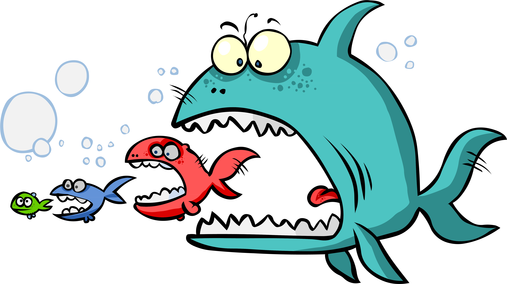

#
# Crazy-Shark
this is a feeding Fish Game
#

## Table of content
* [Play](#play)
* [How to play](#how-to-play)
* [Technology Used](#technology-used) 
* [Team members](#team-members)

# Play
Click on Logo to Start Play :

# How To Play
- Use your mouse to move the fish. 
- Not to be eaten by a bigger fish.
- Collect a lot of sea stars because your lives will increase one for each five sea stars.
- Eat the speacial fish at level 2 to make all big fishes smaller than you.
- Try to finish all levels as fast as possible to get our speed badges for every level.

# Tecnology Used
* HTML
* CSS
* JavaScript

# Team    
1) Abdelrhman Montaser
2) Ahmed Mammdoh Abdel Wahab
3) Abobakr Yousre 
4) Hosam Mohamed Ali
